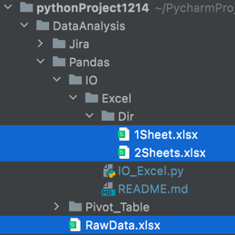
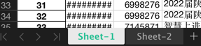

<!-- START doctoc generated TOC please keep comment here to allow auto update -->
<!-- DON'T EDIT THIS SECTION, INSTEAD RE-RUN doctoc TO UPDATE -->
**Table of Contents**  *generated with [DocToc](https://github.com/thlorenz/doctoc)*

- [IO | Excel](#io--excel)
  - [Find / Create Dir](#find--create-dir)
  - [Read](#read)
  - [Write](#write)
    - [*1.* _1 sheet_](#1-_1-sheet_)
    - [*2.* _> 1 sheet_](#2-_-1-sheet_)
  - [Pack](#pack)
    - [ZipFile](#zipfile)
      - [*1.* _1 file_](#1-_1-file_)
      - [*2.* _> 1 files in same folder_](#2-_-1-files-in-same-folder_)

<!-- END doctoc generated TOC please keep comment here to allow auto update -->

# IO | Excel
<font color=#999AAA >Read from excel, or, write in excel to the folder in desired path
<br>

> import os, pandas as pd

## Find / Create Dir
// define the path of desired ```folder``` and try if it has existed:<br> // if yes, pass; if no, generate it.
```python
folder = "Pandas/IO/Dir"
if not os.path.exists(folder):
    os.makedirs(folder)
else:
    print(folder + 'Has Existed !!!')
```
<br>

## Read
```data = pd.read_excel(io='Pandas/RawData.xlsx')``` <br>
// speculate the path of target file is 'Pandas/RawData.xlsx'
// read the content of file as ```data``` '
<br>

## Write
### *1.* _1 sheet_
```python
data.to_excel(folder+'/1Sheet.xlsx',
              sheet_name='Sheet-1',
              float_format='%.2f',
              na_rep='Empty',
              index=False)
```
// write ```data``` to ```Sheet1``` in ```folder/1Sheet.xlsx```, reserve all float with 2 digitals, fill empty cell with 
'Empty' and do not keep index
<br>

### *2.* _> 1 sheet_
```python
with pd.ExcelWriter(
        folder+'/2Sheets.xlsx',
        datetime_format='YYYY-MM-DD') as writer:
    data.to_excel(writer, sheet_name='Sheet-1')
    data.to_excel(writer, sheet_name='Sheet-2')
```
// write ```data``` to both ```Sheet1``` and  ```Sheet2``` in ```folder/2Sheets.xlsx```, format date data as 'YYYY-MM-DD' <br>
// Tip: !!! ofc here you are able to write different data into separate sheets
<br>

> the tree structure of curren working project should look like this:<br><br>
>  <br>
>
> the 2 sheets of '2Sheets.xlsx' should look like this: <br><br>
> <br>

## Pack
### ZipFile
#### *1.* _1 file_
```python
OutputZip = zipfile.ZipFile(folder+'/output.zip', 'w')
OutputZip.write(folder+'/1Sheet.xlsx')
OutputZip.close()
```
// generate a zip file ```output.zip``` in desired path ```folder``` and save as a variable ```OutputZip```;<br>
// write target file ```1Sheet.xlsx``` in target path into ```OutputZip``` and close it in the end
<br>

#### *2.* _> 1 files in same folder_
```python
with zipfile.ZipFile(folder+'/Output.zip', 'w') as OutputZip:
    os.chdir(folder)
    OutputZip.write('1Sheet.xlsx')
    OutputZip.write('2Sheets.xlsx')
    OutputZip.close()
```
// generate a zip file ```output.zip``` in desired path ```folder``` and save as a variable ```OutputZip```;<br>
// change working directory to target path, and write target files in current wd into ```OutputZip``` and close it in the end 